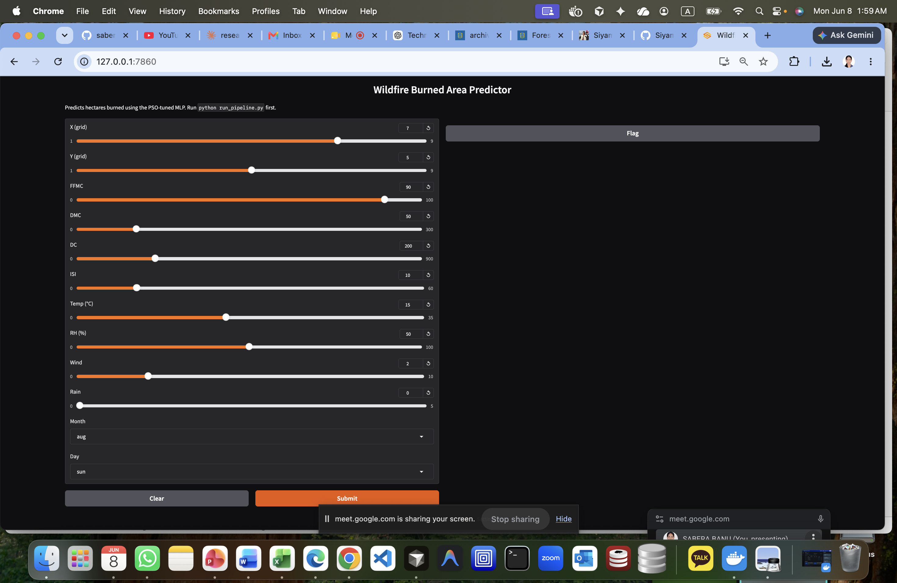

# Wildfire Burned Area Predictor

Metaheuristic-optimized deep learning pipeline for predicting forest fire burned area (hectares) using the [UCI Forest Fires dataset](https://archive.ics.uci.edu/ml/datasets/forest+fires). Combines a PyTorch MLP with SHAP-based feature selection and PSO hyperparameter tuning — exposed through an interactive Gradio demo.

---

## Live Demo

Run the pipeline once, then launch the web UI:

```bash
python run_pipeline.py
python app.py
```

Open **http://127.0.0.1:7860** in your browser.



### Inputs

| Field | Description |
|-------|-------------|
| **X, Y** | Spatial grid coordinates in the Montesinho park map (1–9) |
| **FFMC** | Fine Fuel Moisture Code — surface fuel dryness (0–100) |
| **DMC** | Duff Moisture Code — organic layer moisture (0–300) |
| **DC** | Drought Code — long-term moisture deficit (0–900) |
| **ISI** | Initial Spread Index — fire spread potential (0–60) |
| **Temp** | Air temperature in °C (0–35) |
| **RH** | Relative humidity in % (0–100) |
| **Wind** | Wind speed (0–10) |
| **Rain** | Rainfall in mm/m² (0–5) |
| **Month / Day** | When the fire occurred |

### Output

The app returns a predicted burned area in **hectares**, plus a plain-language risk label:

| Predicted area | Risk level |
|----------------|------------|
| &lt; 1 ha | **Low risk** |
| 1 – 10 ha | **Moderate risk** |
| &gt; 10 ha | **High risk** |

Example: `0.82 hectares` → **Low risk**

---

## Research Pipeline


| Phase | What happens |
|-------|--------------|
| 1. EDA | Explore skewed `area` target, correlations, zero-area fires (~48%) |
| 2. Preprocessing | `log1p(area)`, one-hot encoding, MinMaxScaler, 70/15/15 split |
| 3. Baseline MLP | 3-layer PyTorch network (64 → 32 → 1) |
| 4. SHAP selection | GradientBoosting + SHAP — drop 3 lowest-importance features |
| 5. PSO tuning | Optimize learning rate, hidden size, dropout (10 particles × 20 iters) |
| 6. Evaluation | Compare RMSE, MAE, R² on test set (hectare scale) |

> Models train on `log1p(area)` but all reported metrics use **original hectares** via `expm1`.

---

## Results (test set)

| Model | RMSE (ha) | MAE (ha) | R² |
|-------|-----------|----------|-----|
| Baseline MLP | 124.28 | 20.05 | -0.019 |
| SHAP-reduced MLP | 124.29 | 19.97 | -0.020 |
| PSO-tuned MLP | 124.22 | 20.78 | -0.019 |

PSO best hyperparameters: `lr ≈ 0.009`, `hidden1 = 107`, `hidden2 = 53`, `dropout ≈ 0.11`

SHAP dropped: `month_jan`, `month_nov`, `month_oct`

---

## Quick Start

```bash
git clone https://github.com/saberabanu0001/Wildfire-Burned-Area-Regression.git
cd wildfire

python -m venv .venv
source .venv/bin/activate        # Windows: .venv\Scripts\activate
pip install -r requirements.txt

python run_pipeline.py           # train all models (~1 min)
python app.py                    # launch Gradio demo
```

Outputs are saved to `artifacts/` (models, plots, metrics). Processed splits go to `data/processed/`.

---

## Project Structure

```
wildfire/
├── app.py                  # Gradio web demo
├── run_pipeline.py         # end-to-end training pipeline
├── config.yaml             # seeds, splits, hyperparameters
├── requirements.txt
├── docs/
│   └── ui-screenshot.png   # demo screenshot
├── data/
│   └── forestfires.csv     # UCI dataset
├── notebooks/              # phase-by-phase Jupyter notebooks
│   ├── 01_eda.ipynb
│   ├── 02_preprocessing.ipynb
│   ├── 03_baseline_mlp.ipynb
│   ├── 04_shap_selection.ipynb
│   ├── 05_pso_tuning.ipynb
│   └── 06_evaluation_report.ipynb
├── src/
│   ├── data.py             # load, split, transform
│   ├── models.py           # PyTorch MLP
│   ├── train.py            # training loop + early stopping
│   ├── metrics.py          # RMSE, MAE, R²
│   ├── shap_selection.py   # SHAP feature ranking
│   └── pso_tune.py         # PSO hyperparameter search
└── artifacts/              # generated outputs (gitignored)
    ├── models/             # .pt checkpoints
    ├── plots/              # EDA, SHAP, PSO, prediction plots
    └── results/            # comparison.csv, metrics JSON
```

---

## Google Colab

```python
!git clone https://github.com/saberabanu0001/Wildfire-Burned-Area-Regression.git
%cd wildfire
!pip install -r requirements.txt
!python run_pipeline.py
```

Or open notebooks in `notebooks/` and run cell-by-cell.

---

## Tech Stack

| Component | Library |
|-----------|---------|
| Deep learning | PyTorch |
| Preprocessing | scikit-learn |
| Feature selection | SHAP + GradientBoosting |
| Hyperparameter tuning | pyswarms (PSO) |
| Web demo | Gradio |
| Environment | Python 3.10+, Jupyter, Google Colab |

---

## Dataset

[UCI Forest Fires](https://archive.ics.uci.edu/ml/datasets/forest+fires) — 517 fire events in Montesinho Natural Park, Portugal.

- **12 input features** + 1 target (`area` in hectares)
- **Highly skewed target** — most fires are small, a few are very large
- **~48% zero-area** fires (negligible burn)

---

## License

Academic / research use. Dataset © UCI Machine Learning Repository.
